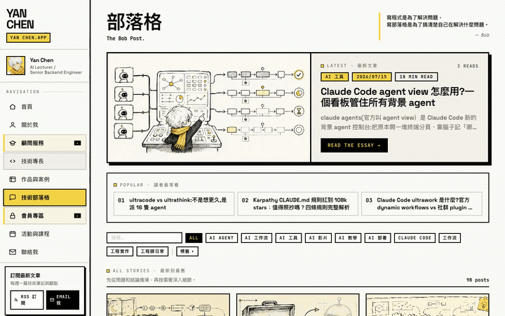

# browser-record

把「操作瀏覽器」錄成教學 / demo 影片的 [Claude Code](https://claude.com/claude-code) skill。

跟你自己開螢幕錄影的差別在兩件事：**錄的時候不占用你的螢幕**（可以被其他視窗完全蓋住，你繼續做別的事），以及**看得出點了哪裡** —— 頁面裡注入一顆會平滑移動的紅色游標，點擊時放出漣漪動畫。



## 為什麼需要它

錄網頁教學影片有個老問題：真實滑鼠游標**只存在於全螢幕錄影**。

macOS 的單視窗錄影（`screencapture -l <windowid>`）讀的是該視窗自己的 backing store，而游標是系統畫在所有視窗**之上**的獨立圖層 —— 所以單視窗錄影不是「沒做這個功能」，是結構上不可能有游標。而全螢幕錄影又逼你把視窗攤在桌面上、錄製期間什麼都不能做，還會錄進一堆桌面雜訊。

這個 skill 的解法是換掉前提：不要去捕捉真的游標，改成**在頁面裡畫一顆假的**。

## 三種模式

| | A 全螢幕 | B 單視窗 | **C Playwright + 假游標** |
|---|---|---|---|
| 真實滑鼠游標 | ✅ | ❌ | ❌（有視覺指示器） |
| 視窗被蓋住也能錄 | ❌ | ✅ | ✅（根本不占螢幕） |
| 畫面乾淨（無桌面雜訊） | ❌ | ✅ | ✅ |
| 看得出點了哪裡 | ✅ | ❌ | ✅ 漣漪動畫 |
| 錄製時你能做別的事 | ❌ | ✅ | ✅ |
| 平台 | macOS | macOS | 跨平台 |

**預設用 C。** 只有在必須呈現真實滑鼠軌跡、或要錄瀏覽器以外的 app 時才用 A。

## 安裝

```bash
git clone https://github.com/yanchen184/browser-record.git ~/.claude/skills/browser-record
cd ~/.claude/skills/browser-record
npm install
npx playwright install chromium
```

裝在 `~/.claude/skills/` 底下，Claude Code 會自動載入。依賴裝在 skill 自己的目錄裡，所以從任何專案目錄執行都能用，不會污染你的專案。

另需 `ffmpeg`（轉 mp4）：`brew install ffmpeg`。

## 用法

跟 Claude Code 說「幫我錄一段這個網站的操作影片」就會自動觸發。手動跑的話：

**1. 寫劇本**（複製 `scripts/example-scenario.mjs` 改）：

```js
export const pace = { cursorMove: 900, afterClick: 1400, readPause: 2200 };

export default async ({ goto, clickAt, scrollBy, type, pause }) => {
  await goto('https://example.com');
  await scrollBy(500);
  await clickAt('a[href="/docs/"]');
  await type('input[name=q]', '搜尋關鍵字');
  await pause();
};
```

可用動作：`goto` / `clickAt` / `moveTo` / `scrollBy` / `type` / `pause`，另外 `page` 是原生 Playwright page，需要進階操作時直接用。

**2. 錄：**

```bash
node ~/.claude/skills/browser-record/scripts/record.mjs ./my-demo.mjs \
  --out ./demo.mp4 --verify
```

參數：`--width 1280 --height 800`、`--verify`（點擊瞬間存證截圖）、`--headless`、`--keep-webm`。

### 模式 A / B（macOS）

```bash
# A：全螢幕，含真實游標，錄 10 秒
./scripts/screen-record.sh full ./out.mp4 10

# B：單視窗，被蓋住照錄
./scripts/screen-record.sh list                    # 先列出視窗
./scripts/screen-record.sh win ./out.mov 15        # 預設抓 Google Chrome
./scripts/screen-record.sh win ./out.mov 15 Safari
```

模式 A 需要「螢幕錄製」權限（系統設定 → 隱私權與安全性），沒授權錄出來是黑畫面。

## 驗收：一定要看點擊瞬間的截圖

假游標是**注入的 DOM 節點**，框架 hydration 有機會把它清掉 —— 錄影跑完不代表游標真的有出現在畫面上。

所以 `--verify` 會在每次點擊的瞬間存一張截圖到輸出資料夾旁邊。交付前**打開其中一張，用眼睛確認紅色游標真的停在目標元素上**。

只看 `OK duration=...` 就當作成功 = 假綠燈。抽影片畫格來驗也不可靠：隨便挑的時間點很可能落在游標移動前後的空檔，看不到不代表沒有。**要驗就驗點擊瞬間的截圖。**

## 踩過的坑

這些都已經在程式碼裡處理掉了，列出來是因為你改的時候可能會撞到：

- **`waitUntil: 'networkidle'` 會 timeout** —— 多數站有長連線（留言系統、分析腳本），永遠不會 idle。改用 `domcontentloaded` + `waitForLoadState('load')`。
- **假游標會被 hydration 清掉** —— 框架接管 DOM 時會移除注入的節點。解法是 `addInitScript` + 導航後延遲補注入 + 每次操作前 `ensureCursor()` 自我修復，並記住座標避免重建時跳回原點。
- **注入節點要掛 `document.body` 不是 `documentElement`** —— 掛 documentElement 比較容易被框架的 DOM 重建掃掉。
- **游標初始在畫面外** —— 初始 transform 是 `translate(-50px,-50px)`，若劇本第一個動作是捲動而非點擊，前段會完全看不到游標。`goto()` 會自動把游標帶到畫面中央。
- **`context.close()` 才會 flush 影片** —— 直接 `browser.close()` 會拿不到檔案。
- **`ffmpeg -list_devices` 一定回非零 exit code** —— 它把 `""` 當輸入檔會報錯。在 `set -euo pipefail` 的腳本裡直接 pipe 會靜默殺掉整個 script（exit 251，看不到任何錯誤訊息），必須用 `|| true` 隔離。
- **avfoundation 裝置行有兩組方括號** —— 格式是 `[AVFoundation indev @ 0x...] [3] Capture screen 0`，用 `-F'[][]'` 取 `$2` 會抓到前面的 log prefix 而不是 index。要用 `sed -nE 's/.*\[([0-9]+)\] Capture screen 0.*/\1/p'`。
- **單視窗錄影：最小化到 Dock 就錄不到** —— backing store 停止更新。蓋住可以，縮小不行。window id 每次開視窗都會變，必須動態抓。

## 授權

MIT
